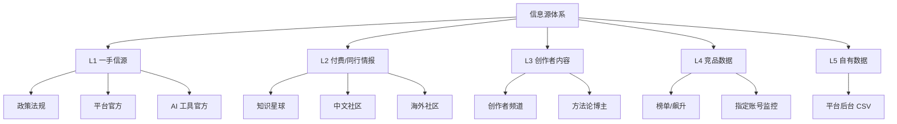
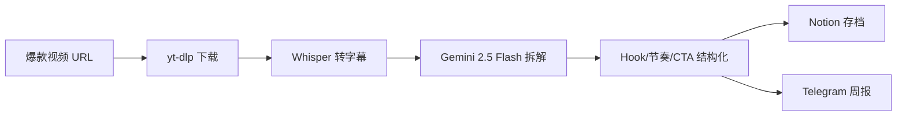
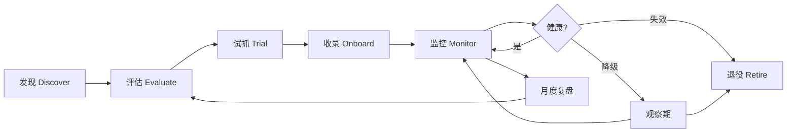
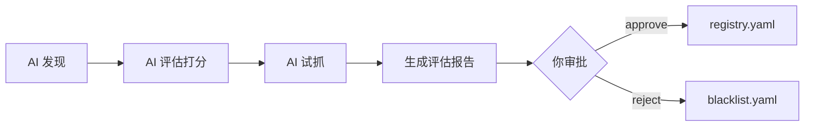
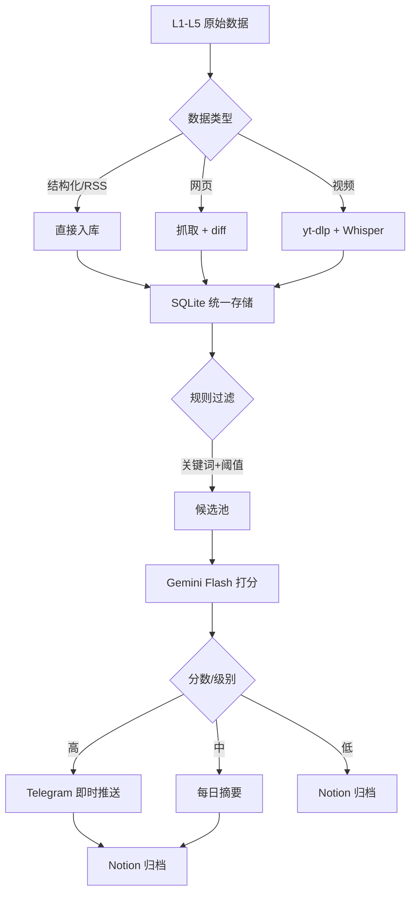

# 信息源大纲

> 面向全职个人创作者的阶段零情报系统总纲，覆盖**短视频 + 直播 + AI 工具**三条主线。按信噪比、合规性、时效性分层，作为后续 `scripts/intelligence/` 各模块的设计依据。

## 设计原则

- **一手 > 二手**：官方原文 > KOL 解读 > 自媒体转述
- **工程化一切重复劳动**：脚本的核心价值就是把人工操作工程化。反爬是技术问题，不是放弃自动化的理由 —— 用分级爬虫策略对应不同难度的源
- **法律红线清晰**：区分「法律禁止」（个人隐私、付费内容商用分发、绕过版权 DRM）和「技术对抗」（反爬、登录墙、频控）。前者不碰，后者用工程化方案解决
- **信噪比分层**：付费社群 > 官方渠道 > 垂直社区 > 综合社区 > 算法推荐流
- **双速情报**：**快情报**（政策/违规/热点，实时推送）+ **慢情报**（方法论/复盘，周度精读）
- **可回溯**：所有入库内容保留原始链接、抓取时间、来源标签

---

## 分层总览



| 层级 | 定位 | 更新节奏 | 处理方式 |
|---|---|---|---|
| **L1 一手信源** | 政策/规则/算法的第一手信源 | 实时 diff | 有变更立即推送 Telegram |
| **L2 付费/同行** | 从业者真实经验、踩坑复盘 | 周度精读 | 人工摘录 + AI 打分 |
| **L3 创作者内容** | 方法论、案例拆解 | 每日订阅 | AI 打分筛选入 Notion |
| **L4 竞品数据** | 爆款规律、趋势拐点 | 每日抓取 | 结构化拆解 + 周报 |
| **L5 自有数据** | 账号健康度、内容复盘 | 周度导入 | 拐点分析 + 周报 |

---

## L1 一手信源（必看，最高优先级）

> [!IMPORTANT]
> 这一层的价值是**躲坑 + 提前布局**。一条新规能让半年内容作废，也能在别人违规时让你捡漏。**每天必看**。

### L1.1 政策法规

| 渠道 | 内容 | 获取方式 | 频率 |
|---|---|---|---|
| **网信办** `www.cac.gov.cn` | AIGC 标识、算法备案、生成式 AI 管理办法 | 网页 diff | 每日 |
| **广电总局** `www.nrta.gov.cn` | 直播资质、内容合规、网络视听新规 | 网页 diff | 每日 |
| **市场监管总局** `www.samr.gov.cn` | 广告法、直播带货新规、虚假宣传处罚 | 网页 diff | 每日 |
| **中国互联网协会** | 行业自律规范 | 网页 diff | 每周 |

### L1.2 平台官方 —— 抖音/字节系

| 渠道 | 内容 | 获取方式 | 优先级 |
|---|---|---|---|
| **抖音安全中心** `www.douyin.com/rules` | 违规公告、封禁案例 | 网页 diff | **P0 必抓** |
| **抖音创作者服务中心** `creator.douyin.com` | 平台公告、功能更新 | 网页 diff | P0 |
| **抖音电商学习中心** `school.jinritemai.com` | 带货规则、类目政策、大促节奏 | 网页 diff | P0（带货相关） |
| **巨量学** `xue.oceanengine.com` | 算法机制、官方方法论课程 | 人工精读 | P1 |
| **巨量引擎官方** 公众号 | 行业白皮书、案例研究 | RSSHub `/wechat/ershicimi/:id` | P1 |
| **抖音开放平台** `open.douyin.com` | API 更新、能力 changelog | 官方 changelog | P2 |

### L1.3 平台官方 —— 小红书

| 渠道 | 内容 | 获取方式 | 优先级 |
|---|---|---|---|
| **小红书创作学院** `creator.xiaohongshu.com/creator-school` | 算法规则、官方爆款拆解 | 网页 diff | P0 |
| **社区公约 / 违规公示** | 违规类目、处罚案例 | 网页 diff | **P0 必抓** |
| **蒲公英平台** | 商单规则、报价体系 | 登录后人工 | P1 |
| **小红书商业动态** 公众号 | 行业报告、案例 | RSSHub | P1 |

### L1.4 平台官方 —— 阿里系

| 渠道 | 内容 | 获取方式 | 优先级 |
|---|---|---|---|
| **淘宝直播学院** `liveschool.taobao.com` | 直播规则、主播培训 | 网页 diff | P1 |
| **淘宝大学** | 电商运营体系课 | 人工精读 | P2 |
| **阿里妈妈官方** 公众号 | 投流工具更新 | RSSHub | P2 |
| **1688 商家学习中心** | 供应链侧视角 | 网页 diff | P2（有供应链需求时） |

### L1.5 平台官方 —— 视频号/B站

| 渠道 | 内容 | 获取方式 | 优先级 |
|---|---|---|---|
| **视频号助手帮助中心** | 规则、功能更新 | 网页 diff | P1 |
| **微信公开课** 公众号 | 生态动向 | RSSHub | P2 |
| **B站创作中心** | UP 主规则、激励计划 | 网页 diff | P2 |

### L1.6 AI 工具官方

> [!TIP]
> AI 视频/配音工具迭代极快，官方博客比媒体报道早 1-2 周。**海外工具领先国内 6-12 个月**，追海外博客是阶段二工具选型的关键。

| 渠道 | 内容 | 获取方式 |
|---|---|---|
| **OpenAI Blog** `openai.com/blog` | GPT / Sora 更新 | 官方 RSS |
| **Anthropic News** `anthropic.com/news` | Claude 更新 | 官方 RSS |
| **Google DeepMind Blog** | Gemini / Veo 更新 | 官方 RSS |
| **Google Cloud Vertex AI 博客** | Gemini API / 计费更新 | 官方 RSS |
| **Runway Research** | Gen-3 / 视频模型 | 官方 RSS |
| **Pika Labs** | 产品更新 | 官网 + Twitter |
| **Luma AI** | Dream Machine 更新 | 官网 + Twitter |
| **HuggingFace Daily Papers** | 学术前沿 | 官方 RSS |
| **阿里通义万相** | 国产视频模型 | 官方博客 |
| **字节即梦 AI** 公众号 | 国产视频模型 | RSSHub |
| **快手可灵** 公众号 | 国产视频模型 | RSSHub |
| **Azure Speech** `learn.microsoft.com/azure/ai-services/speech-service` | TTS 能力更新 | 官方 RSS |

---

## L2 付费/同行情报（周度精读）

### L2.1 知识星球

> [!CAUTION]
> 知识星球**没有开放 API**，属于 T4 级别（见「爬虫工程化策略」章节）。**仅抓取自己已付费加入**的星球，Playwright 持久化登录态，仅自用、低频、不公开分发。

**推荐方向**（需自己付费加入）：

- **短视频 / 直播**：生财有术、粥左罗、剑飞
- **抖音电商**：交个朋友体系、无名的严选
- **AI 工具**：Data Science、通往 AGI 之路、Lyrics AI 前沿
- **独立创作者**：可能性与大时代、自由会谈

**工作流**：

1. 每周固定 30 分钟精读已加入的星球
2. iOS 快捷指令 / 分享菜单 → 摘录到 Notion，保留原文链接
3. 周末跑 `weekly_digest.py` 汇总本周摘录

### L2.2 中文社区

| 社区 | 价值点 | 获取方式 | 优先级 |
|---|---|---|---|
| **V2EX** | 创意工作 / 分享发现 / 酷工作节点 | 官方 API `/api/topics/show.json` | P1 |
| **即刻** | 自媒体/独立创作者圈子（一个人的商业故事、出海、AI 探索站） | RSSHub `/jike/user/:id`、`/jike/topic/:id` | **P0** |
| **知乎** | 「如何看待...」问题下的答主拆解 | RSSHub `/zhihu/question/:id`、`/zhihu/topic/:id` | P1 |
| **豆瓣小组** | 自由职业 / 副业 / 自媒体小组 | RSSHub `/douban/group/:id` | P2 |
| **小红书搜索** | 「做自媒体」「全职博主」真实经验帖 | T4 Playwright（见工程化策略） | P2 |
| **脉脉** | 行业八卦、MCN/平台员工匿名爆料 | T4 Playwright + 登录态 | P2 |

### L2.3 海外社区

> [!TIP]
> 英文社区的方法论/工具讨论**领先国内 6-12 个月**。Reddit + HN + Indie Hackers 是三个必追的源。

| 社区 | 价值点 | 获取方式 | 优先级 |
|---|---|---|---|
| **Reddit** | `r/NewTubers` `r/CreatorServices` `r/youtubers` `r/Entrepreneur` `r/sidehustle` `r/PartneredYoutube` | 官方 JSON API（URL 加 `.json`） | **P0** |
| **Hacker News** | Show HN / Ask HN，创作者工具新品 | Firebase API / Algolia HN Search | P1 |
| **Indie Hackers** | 独立开发者/内容创业复盘，收入数据真实 | RSSHub `/indiehackers/*` | P1 |
| **Product Hunt** | 新工具首发 | 官方 GraphQL API | P2 |
| **Lemmy / Mastodon** | 小众优质讨论 | ActivityPub 原生 RSS | P2 |

### L2.4 垂直群组（T5 级：人工 forward 工程化）

> [!NOTE]
> Discord / Telegram / 微信群属于 T5 —— 不抓取，但**把人工 forward 的成本降到最低**：自建 Telegram Bot + iOS 快捷指令 + 分享菜单一键入库，详见「爬虫工程化策略」章节的 T5 部分。

- **Discord**：Creator Now、Video Creators 等创作者服务器
- **Telegram 频道**：中文圈「独立开发者」「自媒体人」相关频道
- **抖商公社 / 派代**：电商 + 短视频交集，起号/违规案例

---

## L3 创作者内容（每日订阅）

### L3.1 创作者频道 RSS

- **YouTube**：`https://www.youtube.com/feeds/videos.xml?channel_id=XXX`（免费，无需 API Key）
- **B站 UP 主**：RSSHub `/bilibili/user/video/:uid`
- **小红书博主**：RSSHub `/xiaohongshu/user/:user_id`（不稳定，备选）
- **抖音博主**：RSSHub `/douyin/user/:uid`（不稳定，备选）

**起步清单**（自填）：

- 同赛道头部 10 人
- 跨赛道方法论 5 人
- 海外对标 3 人

### L3.2 方法论公众号 / 博主

| 来源 | 内容类型 | 获取方式 |
|---|---|---|
| **运营研究社** | 运营方法论 | RSSHub 公众号路由 |
| **刺猬公社** | 内容行业观察 | RSSHub |
| **新榜** | 数据 + 行业动态 | RSSHub |
| **卡思数据** | 短视频行业研究 | RSSHub |
| **知乎专栏** | 垂直专家长文 | RSSHub `/zhihu/zhuanlan/:id` |

---

## L4 竞品数据

### L4.1 榜单 / 飙升视频

| 工具 | 数据 | 成本 |
|---|---|---|
| **蝉妈妈** `chanmama.com` | 抖音全域数据、飙升视频、达人榜 | 有免费层 |
| **飞瓜数据** `feigua.cn` | 抖音/快手/B站、内容分析 | 有免费层 |
| **新抖** `xd.newrank.cn` | 抖音数据、达人监控 | 有免费层 |
| **千瓜数据** `qian-gua.com` | 小红书专属 | 有免费层 |

> [!WARNING]
> 抖音/小红书站内深度抓取属于 T4，逆向 API 不划算。推荐组合：**SaaS 免费层打底**（蝉妈妈/飞瓜/千瓜已经替你解决了风控）+ **Playwright 抓 SaaS 覆盖不到的长尾账号**。把工程化预算投在 SaaS 盲区，而不是硬怼平台风控。

### L4.2 指定账号监控

- RSSHub 抖音/小红书路由（不稳定，备选）
- 手动维护「关注清单」CSV，半自动化抓取

### L4.3 AI 拆解管线



---

## L5 自有数据

> [!IMPORTANT]
> 自己账号后台的自动化属于 T4（平台风控同样严）。**起步阶段手动导 CSV，封号风险 >> 省下的时间**。等工具稳定、账号矩阵建起来后，再用 Playwright 持久化登录态做自动导出，放在单独的小号或专用设备上跑。

| 平台 | 导出方式 | 频率 |
|---|---|---|
| **抖音创作者服务中心** | 数据 → 导出 CSV | 每周 |
| **巨量百应 / 星图** | CSV 导出 | 每周（有商单时） |
| **小红书蒲公英** | CSV 导出 | 每周 |
| **视频号助手** | CSV 导出 | 每周 |

**处理**：统一 schema → SQLite → Gemini 拐点检测 → 周报。

---

## 爬虫工程化策略

> [!IMPORTANT]
> 前面各层提到「不稳定」「明确禁止爬取」「人工为主」的地方，**不代表放弃自动化**。脚本的核心价值就是把人工操作工程化，降低个人时间成本。针对不同难度的源使用不同的技术栈分级对应。

### 红线 vs 技术对抗

先区分两件事，避免混淆：

| 类型 | 举例 | 策略 |
|---|---|---|
| **法律红线** | 抓取他人个人隐私数据、将付费内容公开分发、绕过 DRM、恶意 DDoS | 不碰 |
| **ToS 灰色** | 平台 ToS 禁止爬取，但仅抓取公开内容自用 | 低频 + 账号隔离 + 自用，不公开分发 |
| **纯技术对抗** | 反爬、验证码、登录墙、频控、JS 渲染、指纹检测 | **工程化解决** |

> [!NOTE]
> 知识星球、抖音、小红书等源归在「ToS 灰色 + 技术对抗」：**仅抓取自己有权限访问的公开内容，仅自用，不公开分发**，就是可接受的工程化目标。

### 源难度分级

| 级别 | 特征 | 典型源 | 技术栈 |
|---|---|---|---|
| **T1 开放 API/RSS** | 官方提供、无频控或宽松 | YouTube RSS、Reddit `.json`、HN Firebase API、V2EX API | `httpx` + `feedparser`，裸请求即可 |
| **T2 轻反爬** | 无登录、有基础 UA/频控检测 | 大部分公众号（via RSSHub）、政府官网、官方博客 | `httpx` + 随机 UA + 节流 |
| **T3 中反爬** | JS 渲染、需登录、Cloudflare/风控 | 即刻、知乎、豆瓣、B站、SaaS 免费层 | Playwright + 持久化登录态 + 住宅代理池 |
| **T4 强反爬** | 设备指纹、行为检测、验证码、加密参数 | 抖音、小红书、知识星球、蒲公英 | `agent-browser`/Playwright-stealth + 指纹伪装 + 真机/真实操作节奏 + 打码平台 |
| **T5 不可抓** | 端到端加密、付费 DRM、封闭 App | 微信群、Discord 私域、部分直播中控 | 放弃，走人工 forward |

### 分级技术方案

**T1：开放 API / RSS**

- `httpx` + `feedparser` 直接请求
- 部署：cron / systemd timer，无需特殊处理
- 代表：YouTube、Reddit、HN、V2EX、所有官方 RSS

**T2：轻反爬（UA + 节流即可）**

```python
# 核心要点
- UA 轮换（fake-useragent 或预置列表）
- 请求间隔 2-5 秒随机
- 失败指数退避
- respect robots.txt（红线礼貌版）
```

适用：RSSHub 自托管、政府/官方网页 diff、方法论博客

**T3：中反爬（Playwright 持久化）**

核心思路：**用真浏览器，复用登录态**

```
scripts/intelligence/fetchers/
├── browser/
│   ├── profiles/          # Playwright 持久化 user-data-dir
│   │   ├── jike/
│   │   ├── zhihu/
│   │   └── bilibili/
│   ├── base.py            # 统一封装：启动/复用/截图/重试
│   └── session_manager.py # 登录态健康检查 + 过期告警
```

工具选择：

- **Playwright**（主力）：比 Puppeteer 更稳，原生支持持久化 context
- **playwright-stealth**：消除 `navigator.webdriver` 等指纹特征
- **agent-browser**（已装，CLAUDE.md 有用法）：调试和探索期用，抓取期切到原生 Playwright

关键技巧：

- **持久化登录态**：首次手动登录，保存 `user-data-dir`，后续复用，避免频繁触发风控
- **代理池**：住宅 IP（Bright Data / IPIDEA / 青果 / Luminati），按国家/运营商切换
- **请求节奏**：模拟真人（滚动、停顿、点击间隔），**不要**裸 `goto` + `content()`
- **健康检查**：每次抓取前先访问一个无害页面，检测是否被风控

**T4：强反爬（抖音/小红书/知识星球类）**

这类平台都有完整风控体系，**不要硬怼接口**。用「模拟真人浏览 + 页面提取」的路线：

1. **不调内部 API**：抖音 `_signature`、小红书 `x-s`/`x-t` 都是动态加密参数，逆向成本高且易变
2. **走前端渲染结果**：Playwright 打开页面，等 DOM 渲染完，解析页面 DOM 或拦截 XHR 响应
3. **设备指纹伪装**：`playwright-stealth` + 固定 user-data-dir + WebGL/Canvas 指纹一致
4. **账号矩阵**：准备 2-3 个小号轮换（非主号），每个号配独立 user-data-dir + 独立住宅 IP
5. **低频 + 离散**：每个账号每天抓取量严格控制（如 <50 次请求），避开 0-6 点
6. **验证码兜底**：接 2Captcha / YesCaptcha，极少触发但要有退路
7. **失败熔断**：连续失败 N 次立即停 24h，避免封号

> [!WARNING]
> T4 是**工程化投入最大**的一档。个人开发者建议：**SaaS 工具免费层（蝉妈妈/飞瓜/千瓜）优先**，把工程化精力留给 SaaS 覆盖不到的长尾源。

**知识星球专项**：

- 只抓取**自己已付费加入**的星球
- 登录网页版 `wx.zsxq.com`，Playwright 持久化 context
- 只抓精华区 + 关键词命中的新帖
- 存本地 SQLite，**严格自用**，不同步云端、不公开分发
- 频率：每天 1 次，每次 <20 请求

**T5：不可抓（人工 forward 工程化）**

对真正抓不到的源（微信群、Discord、小圈 Telegram），工程化方向是「降低人工 forward 成本」：

- **Telegram**：自建 Bot，群里 forward 给 Bot，Bot 自动入库 + AI 打标
- **微信**：用 iOS 快捷指令，分享菜单一键发到自己的 Bot
- **Discord**：浏览器书签栏一键「复制链接 + 选中文本」脚本

### 统一调度层

所有抓取器实现统一接口，调度层不关心底层技术：

```
scripts/intelligence/
├── fetchers/
│   ├── base.py              # Fetcher 基类：fetch() -> List[Item]
│   ├── rss.py               # T1/T2
│   ├── api.py               # T1（Reddit/HN/V2EX）
│   ├── web_diff.py          # T2（官方网页 diff）
│   └── browser/             # T3/T4（Playwright）
│       ├── jike.py
│       ├── xhs.py
│       ├── douyin.py
│       └── zsxq.py
├── scheduler.py             # cron 式调度，每个源独立频率
├── proxy_pool.py            # 住宅代理池管理
├── fingerprint.py           # 指纹伪装配置
└── health.py                # 登录态/代理/风控状态监控
```

### 基础设施清单

| 组件 | 用途 | 推荐 |
|---|---|---|
| 浏览器自动化 | T3/T4 抓取 | Playwright + playwright-stealth |
| 住宅代理池 | IP 轮换 | 青果 / IPIDEA（国内）、Bright Data（海外） |
| 指纹管理 | 多账号隔离 | 持久化 user-data-dir（轻量）/ AdsPower（重） |
| 打码 | 验证码兜底 | 2Captcha / YesCaptcha |
| 调度 | 定时触发 | cron / systemd timer / n8n（后期） |
| 监控 | 健康告警 | Telegram Bot 推送失败告警 |
| 存储 | 统一入库 | SQLite（起步）→ Postgres（数据量大后） |

### 合规自检 checklist

开工前对每个源过一遍：

- [ ] 抓取内容是否为**公开可访问**（非付费墙内、非隐私数据）
- [ ] 是否**仅自用**（不公开分发、不商用转售）
- [ ] 频率是否**低于人类浏览强度**（不造成服务器负担）
- [ ] 是否**尊重 robots.txt**（除非有强需求且能承担后果）
- [ ] 数据落地是否**本地加密/访问控制**（尤其星球类内容）
- [ ] 是否有**失败熔断**（避免账号被封的连锁反应）

全部 ✅ 才进 T3/T4 管线。

---

## 数据源生命周期管理

> [!IMPORTANT]
> 信息源大纲本身是**活资产**，不是一次性清单。阶段零最大的陷阱是「第一天铺 50 个源，三个月后一半死链、一半沉默、真正有价值的新源没进来」。数据源维护是与抓取管线平行的**元系统**，独立运行。

### 核心观察

抓取管线处理**内容**（高频流动），数据源维护处理**源本身的元数据**（低频变动，但每次变动影响所有未来抓取）。忽略源维护的后果：

- 死链累积 → 调度器持续跑失败任务
- 沉默源占位 → 以为覆盖某领域，其实早已没更新
- 新兴源漏收 → 同行都在看的新社区你不知道
- 登录态过期 → T3/T4 源悄悄罢工无感知

### 生命周期



---

### 1. 发现（Discover）

**手动渠道**：

- **内部引用挖掘**：你已订阅源里播主提到的其他播主、Reddit 帖子里的工具链接、公众号引用的星球名 —— 都是最高价值种子
- **定向搜索**：`site:v2ex.com 短视频 起号`、`"生财有术" 知识星球 推荐`
- **同行问卷**：KOL 的「我每天看什么」类文章

**自动化渠道**：

- **从已有内容挖新源**：`discover.py` 从入库帖子里提取 URL / @提及 / 社群名，统计频次，高频未收录的进候选池
- **Gemini 提取**：把一批已归档内容丢给 AI，让它列出「出现频率高但未订阅的信源」
- **相关性推荐**：Reddit `/r/X/related`、YouTube 频道推荐、RSSHub Radar 浏览器扩展（任何网站自动发现可订阅路由）

**产物**：`sources/candidates.yaml`（候选池，含发现来源、发现时间、初步描述）。

#### 全自动发现工作流（推荐方案）

> [!IMPORTANT]
> 选型：**全自动 + AI 发现**。`discover.py` 不是单个脚本，而是多管齐下的挖掘矩阵。你的角色从"找源"变成"审批评估报告"，每周 5-10 分钟。

**三条挖掘管线**：

**管线 1：内容内部引用提取**（ROI 最高）

```
已入库帖子 → 正则/LLM 提取 URL、@提及、社群名、博主名
         → 去重 + 排除已收录
         → 按出现频次排序
         → 进入候选池
```

高频出现但未订阅的源 = 你的信息盲区。信号来自你已信任的源，质量最高。

**管线 2：Gemini 主动推荐**（每周一次）

把过去一周的高价值归档内容喂给 Gemini 2.5 Pro（这里值得用 Pro 不用 Flash）：

```text
以下是我过去一周阅读的 50 条高价值内容（来源/标题/摘要）。
我的身份：全职短视频/直播创作者，赛道 XXX。
现有订阅源：[registry.yaml 摘要]

请推荐 10 个我可能漏掉的信息源：
- 博主/频道/社区/公众号/播客均可
- 必须真实存在、可订阅
- 说明推荐理由和预期价值
- 标注获取难度（T1-T5 分级）
- 避免推荐已订阅源
```

**管线 3：平台生态自动漫游**

利用平台自身的推荐关系网络做种子爬取：

- **Reddit**：已订阅 subreddit 侧边栏 `related subreddits` 扩展
- **YouTube**：已订阅频道的 `channels` 标签页扩展
- **RSSHub Radar**：每周跑一遍已订阅站点，发现新路由
- **Product Hunt / Hacker News**：每天扫一遍，提取工具类新品

#### 候选池的冷却 + 去重

全自动的风险是**候选池爆炸**，必须加约束：

| 机制 | 规则 |
|---|---|
| **URL 标准化去重** | 剥离 utm/fbclid 等参数后比对 |
| **名称模糊匹配** | 防止「生财有术」vs「生财」重复入池 |
| **冷却期** | 同一候选 30 天内只评估一次 |
| **黑名单** | 手动 reject 过的源进 `blacklist.yaml`，永不再推 |
| **容量上限** | 候选池 >100 自动清理最旧条目 |

#### 审批闭环



每周生成一份《本周候选源评估报告》推送到 Telegram / Notion，你只勾选 approve/reject，其他全自动。

**产物文件**：

```
scripts/intelligence/sources/
├── candidates.yaml     # 候选池
├── blacklist.yaml      # 拒绝名单
├── discover.py         # 三条管线的调度器
├── discover/
│   ├── internal_refs.py    # 管线 1
│   ├── gemini_recommend.py # 管线 2
│   └── platform_crawl.py   # 管线 3
└── weekly_digest.py    # 每周候选审批报告
```

---

### 2. 评估（Evaluate）

候选池不直接接入，先过评估：

| 维度 | 问题 | 数据来源 |
|---|---|---|
| **活跃度** | 最近 30 天更新频率 | 爬首页样本 |
| **信噪比** | 抽 10 篇 Gemini 打分平均值 | AI 评估 |
| **相关度** | 匹配你的赛道/关注词 | AI 评估 |
| **独特性** | 与现有源内容重复度 | 向量相似度对比 |
| **可获取性** | T1-T5 哪一级，成本多少 | 技术评估 |
| **作者可信度** | 从业者 / 搬运号 | 人工 + AI |

**工程化**：

```
scripts/intelligence/sources/
├── evaluator.py        # 抓 10-20 个样本 + Gemini 打分
└── reports/            # 评估报告归档
    └── 2026-04-09_xxx.md
```

---

### 3. 试抓（Trial）

评估通过后**影子运行 1-2 周**：

- 接入管线但**不推送**，只入库
- 观察指标：抓取成功率、内容质量分布、与现有源重复度、AI 平均分
- 记录到 `source_trial_log.md`

> [!TIP]
> 这一步最容易被跳过。很多源纸面评估看着好，实际接入后反爬太烦、或与现有源严重重叠、或风格对不上。试抓期是买保险。

---

### 4. 收录（Onboard）

试抓通过后正式入库。`registry.yaml` 是整个系统的**配置中心**和**唯一真相源**：

```yaml
# sources/registry.yaml
- id: reddit_newtubers
  name: r/NewTubers
  tier: L2                    # 内容分层（L1-L5）
  level: T1                   # 技术难度（T1-T5）
  fetcher: reddit_api
  url: https://reddit.com/r/NewTubers
  schedule: "0 */6 * * *"
  enabled: true
  filter:
    min_upvotes: 20
    keywords_include: [...]
    keywords_exclude: [...]
  ai_scoring:
    model: gemini-2.5-flash
    threshold: 7
  metadata:
    discovered_at: 2026-04-09
    discovered_from: "manual"
    owner_note: "新手向，周末帖子密度高"
    language: en
    topics: [youtube, growth, monetization]
  health:
    last_success: null
    consecutive_failures: 0
    avg_items_per_day: null
    last_reviewed: 2026-04-09
```

> [!IMPORTANT]
> 调度器只读 `registry.yaml`，不关心生命周期管理。源管理层单独维护 registry，解耦两套系统。

---

### 5. 监控（Monitor）

每次抓取后自动更新 `health` 字段。告警规则：

| 症状 | 触发 | 动作 |
|---|---|---|
| 连续失败 ≥3 次 | 抓取层 | Telegram 告警 + 自动降级到观察期 |
| 日均条数跌至历史 10% | 日任务 | 标记"疑似沉默"，人工复核 |
| AI 平均分连续 2 周 <5 | 周任务 | 标记"质量劣化"，人工复核 |
| 登录态过期（T3/T4） | 健康检查 | Telegram 通知手动重登 |
| 30 天零新增 | 月任务 | 自动移入观察期 |

---

### 6. 复盘与退役（Review & Retire）

**月度复盘**自动生成报告：

- **Top 10 高价值源**（AI 分 × 原创率 × 你的阅读率）
- **Bottom 10 源**（低分 + 低活 + 高重复）
- **沉默源**（30 天零新增）
- **新收录候选**（本月从发现池进入评估的）

**动作策略**：

- Top 10 → 提升抓取频率 / 深度订阅
- Bottom 10 → 进入观察期 30 天，仍无改善则退役
- 退役 = `enabled: false`，保留配置和历史数据

> [!IMPORTANT]
> **退役不是删除**。保留记录是为了未来源复活、或换赛道后重新启用。所有退役源归档到 `retired.yaml`。

---

### 目录结构

```
scripts/intelligence/
├── sources/                 # 源生命周期管理
│   ├── registry.yaml        # 正式收录清单（唯一真相源）
│   ├── candidates.yaml      # 候选池
│   ├── retired.yaml         # 退役归档
│   ├── discover.py          # 发现：从内容中挖新源
│   ├── evaluator.py         # 评估：抽样 + AI 打分
│   ├── trial.py             # 试抓：影子运行
│   ├── health.py            # 健康监控：失败/沉默/质量
│   ├── review.py            # 月度复盘报告
│   └── reports/             # 评估报告 + 月度报告归档
├── fetchers/                # 抓取器（T1-T5 分级实现）
└── ...
```

---

### 落地节奏

> [!NOTE]
> 不要第一周就搞完整生命周期。按「先能跑，再能活」的顺序。

| 阶段 | 动作 |
|---|---|
| **第 1-2 周** | 只做 `registry.yaml` + 基础健康监控（失败告警），先跑起来 |
| **第 3-4 周** | 加月度复盘报告，手动过一遍现有源 |
| **第 5-8 周** | 加 `discover.py` 自动挖新源，建立候选池流程 |
| **第 9 周起** | 加评估器 + 试抓流程，完整闭环 |

---

## 统一处理管线



### 双层筛选

1. **规则过滤**（便宜、先行）
   - 关键词白名单：`起号` `完播率` `违规` `MCN` `全职` `变现` `算法` `新规` ...
   - 黑名单：`求助` `推广` `转让` ...
   - 互动阈值：V2EX 回复 >5、Reddit upvote >20、知乎赞 >50
2. **AI 打分**（放在规则过滤后）
   - Gemini 2.5 Flash 打 0-10 分，维度：`信息密度` `真实性` `对新手价值`
   - ≥7 分进 Notion，≥9 分推送 Telegram
   - 成本：1000 条帖子约几毛钱

### 分级推送

| 级别 | 触发条件 | 通道 |
|---|---|---|
| **紧急** | L1 政策/违规公示有新增 | Telegram 即时 |
| **重要** | AI 打分 ≥9，或订阅的头部账号新发 | Telegram 每日合集 |
| **参考** | AI 打分 7-8 | Notion 归档，每周摘要 |
| **存档** | 其他通过规则过滤 | Notion 归档 |

---

## Notion 数据库结构

统一 schema，所有来源入同一张表便于检索：

| 字段 | 类型 | 说明 |
|---|---|---|
| 标题 | Title | |
| 来源 | Select | L1-L5 分层标签 |
| 平台 | Select | 抖音/小红书/Reddit/... |
| 原始链接 | URL | |
| 作者 | Text | |
| 抓取时间 | Date | |
| 发布时间 | Date | |
| 标签 | Multi-select | 政策/算法/方法论/工具/案例/变现 |
| AI 摘要 | Text | Gemini 生成 |
| AI 评分 | Number | 0-10 |
| 状态 | Select | 未读/已读/精读/归档 |

---

## 落地优先级

### 第 1 周：打通管线

1. **RSSHub 自托管**（Docker）
2. **Notion 数据库建表**
3. **SQLite 本地库 + Telegram Bot**
4. 接入 **3 个最关键信源**作为端到端验证：
   - 抖音安全中心（L1 网页 diff）
   - Reddit `r/NewTubers`（L2 官方 API）
   - 3 个 YouTube 创作者频道（L3 RSS）

### 第 2-3 周：扩源

- L1 所有 P0 渠道全量接入
- L2 即刻 + Reddit 全部订阅
- L3 RSS 订阅清单铺到 20 个

### 第 4 周：引入 AI 筛选

- 规则过滤先跑一周积累样本
- Gemini Flash 打分管线上线
- 开始生成每日摘要 + 每周精华

### 第 5 周起：竞品与自有数据

- L4 SaaS 工具免费层接入
- L5 CSV 导入管线 + 周报

---

## 开放问题

- **赛道定位**：影响 L3 创作者清单、L4 关注账号、AI 打分提示词
- **已付费星球**：决定 L2.1 的实际覆盖范围
- **预算**：L4 SaaS 工具是否升级到付费层
- **Notion workspace**：是否已有可直接接入
