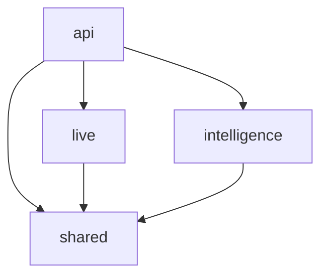

# Python Monorepo Migration Design

**Date**: 2026-04-18
**Status**: Draft — pending user review
**Scope**: Refactor only (no new features)
**Target branch**: `refactor/python-monorepo`

## 1. Background

Vision 当前 Python 端是**单一 `pyproject.toml`**：所有运行时依赖（FastAPI、LiteLLM、chromadb、Playwright、google-genai、betterproto 等）共享一个环境；所有代码挂在 `src/` 下按模块分子目录（`api` / `live` / `intelligence` / `audio` / `video` / `shared`）。JS 端已经是 pnpm + turbo 的 monorepo（`apps/web`、`packages/ui`、`packages/icons`），但 Python 不是。

接下来计划新增多个独立模块（短视频 ASR 管线、竞品情报抓取、选题监控、素材处理），它们各自有重量级依赖（如 `demucs` 带 PyTorch ~2GB、`yt-dlp`、`faster-whisper` 等），不应该污染 `live` 的运行环境。同时这些模块希望逻辑边界清晰、以后可独立发布。

本次改造把 Python 端也转成 **uv workspace monorepo**，为后续新模块提供"独立包"能力。本次**不引入任何新功能**，改造完成后行为与改造前完全一致。

> [!IMPORTANT]
> 本 spec 仅覆盖仓库结构改造。ASR 管线设计、LangChain 取舍、Vertex 凭证等业务决策延后到下一轮独立 spec。

## 2. Goals / Non-Goals

### Goals

- 建立 `python-packages/` 目录与根 `pyproject.toml` 的 `[tool.uv.workspace]` 声明
- 把 `src/` 下 4 个非空模块迁到 `python-packages/{shared,intelligence,live,api}/`
- 每个包独立 `pyproject.toml`，声明自身 runtime 依赖 + 包间依赖
- 所有 import 从 `src.xxx.yyy` 改为 `vision_xxx.yyy`
- 测试就近（constitution 硬要求）
- FastAPI 仍能启动，直播 / RAG / plans 行为不变

### Non-Goals

- 新增功能（ASR 管线、业务变更）
- 修 bug / 重构业务逻辑（除非 import 迁移必须）
- 发布到 PyPI（配置支持未来发布，本次不执行）
- 改动 `apps/web` 与 `packages/{ui,icons}`（已是 JS monorepo）

### Success Criteria

1. `uv sync` 从根目录一次装好所有 workspace 成员
2. `uv run pytest` 从根目录跑所有包的测试全绿
3. `uv run uvicorn vision_api.main:app` 起 FastAPI，`GET /health` 返回 `200`
4. `src/` 下旧目录全部清空并删除
5. 现有 live / RAG / plans 端点人工冒烟通过

## 3. Target Layout

```text
vision/
├── pyproject.toml                 # 仅 workspace 声明 + dev 工具
├── uv.lock                        # 全局锁
├── python-packages/
│   ├── shared/
│   │   ├── pyproject.toml
│   │   └── src/vision_shared/
│   │       ├── __init__.py
│   │       ├── db.py
│   │       ├── event_bus.py
│   │       └── ...
│   ├── intelligence/
│   │   ├── pyproject.toml
│   │   └── src/vision_intelligence/
│   │       └── __init__.py        # 空，占位，未来放 ASR 等模块
│   ├── live/
│   │   ├── pyproject.toml
│   │   └── src/vision_live/
│   │       ├── session.py
│   │       ├── routes.py
│   │       ├── plan_routes.py
│   │       ├── rag_routes.py
│   │       ├── danmaku_manager.py
│   │       └── ...
│   └── api/
│       ├── pyproject.toml
│       └── src/vision_api/
│           ├── __init__.py
│           ├── main.py
│           ├── settings.py
│           └── deps.py
├── apps/web/                      # 不动
├── packages/{ui,icons}/           # 不动
├── scripts/                       # import 同步更新
├── data/
├── output/
├── docs/
├── vision.db
└── Makefile
```

> [!NOTE]
> 当前 `src/audio/` / `src/video/` 是空目录，本次不建对应包。未来有代码时再新建 `python-packages/audio` / `python-packages/video`。

### Dependency Graph



- `shared` 是叶子（不依赖任何内部包）
- `intelligence` 只依赖 `shared`
- `live` 只依赖 `shared`
- `api` 依赖 `shared` / `intelligence` / `live`

> [!WARNING]
> `live` **不允许** import `intelligence`，反之亦可。两者都应只通过 `shared` 或（未来）事件总线解耦。违反会形成循环依赖。

## 4. Package Configurations

### 4.1 Root `pyproject.toml`

```toml
[project]
name = "vision"
version = "0.1.0"
description = "Vision dev-environment aggregator"
requires-python = ">=3.13"
license = { text = "MIT" }
dependencies = [
    "vision-api",   # 聚合入口：装了它等于装全家
]

[tool.uv.workspace]
members = ["python-packages/*"]

[tool.uv.sources]
vision-shared = { workspace = true }
vision-intelligence = { workspace = true }
vision-live = { workspace = true }
vision-api = { workspace = true }

[dependency-groups]
dev = [
    "pytest>=9.0.3",
    "pytest-asyncio>=0.24",
    "httpx>=0.27",
    "ruff>=0.8.0",
]

[tool.pytest.ini_options]
asyncio_mode = "auto"
testpaths = ["python-packages"]
python_files = ["*.test.py"]
markers = [
    "slow: tests that download models / run real embeddings",
]

[tool.ruff]
target-version = "py313"
line-length = 100

[tool.ruff.lint]
select = ["E", "W", "F", "I", "B", "C4", "UP"]
ignore = ["E501"]

[tool.ruff.format]
quote-style = "double"
indent-style = "space"
```

### 4.2 `python-packages/shared/pyproject.toml`

```toml
[project]
name = "vision-shared"
version = "0.1.0"
description = "Vision shared utilities: database, event bus, common helpers"
requires-python = ">=3.13"
license = { text = "MIT" }
dependencies = [
    "aiosqlite>=0.20",
    "pyyaml>=6.0.3",
    "python-dotenv>=1.2.2",
]

[build-system]
requires = ["hatchling"]
build-backend = "hatchling.build"

[tool.hatch.build.targets.wheel]
packages = ["src/vision_shared"]
```

### 4.3 `python-packages/intelligence/pyproject.toml`

```toml
[project]
name = "vision-intelligence"
version = "0.1.0"
description = "Vision intelligence modules (competitor monitoring, topic discovery, content ingestion)"
requires-python = ">=3.13"
license = { text = "MIT" }
dependencies = [
    "vision-shared",
]

[build-system]
requires = ["hatchling"]
build-backend = "hatchling.build"

[tool.hatch.build.targets.wheel]
packages = ["src/vision_intelligence"]
```

### 4.4 `python-packages/live/pyproject.toml`

```toml
[project]
name = "vision-live"
version = "0.1.0"
description = "Vision live-streaming modules: session, danmaku, TTS, RAG, LLM gateway"
requires-python = ">=3.13"
license = { text = "MIT" }
dependencies = [
    "vision-shared",
    "litellm>=1.50.0",
    "chromadb>=0.5.0",
    "sentence-transformers>=3.0.0",
    "google-genai>=1.72.0",
    "google-cloud-aiplatform>=1.147.0",
    "google-cloud-texttospeech>=2.17.0",
    "pyttsx3>=2.99",
    "sounddevice>=0.5.5",
    "numpy>=2.4.4",
    "mitmproxy>=12.2.1",
    "playwright>=1.49.0",
    "betterproto>=2.0.0b7",
]

[build-system]
requires = ["hatchling"]
build-backend = "hatchling.build"

[tool.hatch.build.targets.wheel]
packages = ["src/vision_live"]
```

### 4.5 `python-packages/api/pyproject.toml`

```toml
[project]
name = "vision-api"
version = "0.1.0"
description = "Vision FastAPI entrypoint"
requires-python = ">=3.13"
license = { text = "MIT" }
dependencies = [
    "vision-shared",
    "vision-intelligence",
    "vision-live",
    "fastapi>=0.115",
    "uvicorn[standard]>=0.30",
    "pydantic-settings>=2.0",
    "python-multipart>=0.0.9",
]

[project.scripts]
vision-api = "vision_api.main:run"

[build-system]
requires = ["hatchling"]
build-backend = "hatchling.build"

[tool.hatch.build.targets.wheel]
packages = ["src/vision_api"]
```

> [!NOTE]
> `vision-api` 注册脚本入口 `vision-api`，`uv run vision-api` 等价于 `uvicorn vision_api.main:app`。`main.py` 需补一个 `run()` 函数包装 uvicorn 启动。

### 4.6 Dependency Allocation Reference

从根旧 `pyproject.toml` 的 29 个 runtime 依赖分配到各包：

- **shared**：`aiosqlite`、`pyyaml`、`python-dotenv`
- **intelligence**：仅 `vision-shared`（占位，未来扩展）
- **live**：`litellm`、`chromadb`、`sentence-transformers`、`google-genai`、`google-cloud-aiplatform`、`google-cloud-texttospeech`、`pyttsx3`、`sounddevice`、`numpy`、`mitmproxy`、`playwright`、`betterproto`
- **api**：`fastapi`、`uvicorn[standard]`、`pydantic-settings`、`python-multipart`

> [!IMPORTANT]
> 迁移实施时必须按实际 import 核对每个包的依赖，上表是初始归属，不是授权清单。若某包实际没用到某个包列出的依赖，要从该包的 `dependencies` 中删除。

## 5. Import Migration

### 5.1 Naming Mapping

| 旧 import | 新 import |
|-----------|-----------|
| `from src.shared.db import Database` | `from vision_shared.db import Database` |
| `from src.shared.event_bus import EventBus` | `from vision_shared.event_bus import EventBus` |
| `from src.live.session import SessionManager` | `from vision_live.session import SessionManager` |
| `from src.live.routes import router` | `from vision_live.routes import router` |
| `from src.live.plan_routes import router` | `from vision_live.plan_routes import router` |
| `from src.live.rag_routes import router` | `from vision_live.rag_routes import router` |
| `from src.live.danmaku_manager import DanmakuManager` | `from vision_live.danmaku_manager import DanmakuManager` |
| `from src.api.settings import get_settings` | `from vision_api.settings import get_settings` |
| `from src.api.deps import ...` | `from vision_api.deps import ...` |

规则：**`src.<pkg>.<rest>` → `vision_<pkg>.<rest>`**。

### 5.2 Tooling

- 使用 `ruff check --select I` 找出 import 块
- 使用 `libcst` 或直接 `sed` 批量替换（迁移脚本临时用，不入 repo）
- 每个包迁完跑一次 `uv run ruff check python-packages/<pkg>`

### 5.3 Migration Order (bottom-up)

1. **shared**（无内部依赖）
2. **intelligence**（只建壳，当前无代码）
3. **live**（依赖 shared）
4. **api**（依赖全部）

每步完成后跑全量 `pytest` + FastAPI 冒烟，绿灯才进下一步。

### 5.4 `scripts/` Directory

`scripts/seed_plans.py` 等文件里的 import 按同样规则改写。改完运行脚本确认无破坏。

### 5.5 No Compatibility Shim

**不做** `src.xxx` → `vision_xxx` 的 re-export shim。C1 一次性迁移定了就不留尾巴。

## 6. Testing Strategy

### 6.1 Test Location

全部就近（constitution 硬要求）。迁移后所有测试文件紧邻对应源文件，统一命名 `*.test.py`（与 `src/live/` 现有风格一致）。

根目录 `tests/` 当前有：

- `tests/api/test_live_routes.py` → 迁到 `python-packages/api/src/vision_api/live_routes.test.py`
- `tests/shared/test_db.py` → 迁到 `python-packages/shared/src/vision_shared/db.test.py`
- `tests/shared/test_event_bus.py` → 迁到 `python-packages/shared/src/vision_shared/event_bus.test.py`

迁完后删除根 `tests/` 目录（含 `__init__.py`）。

### 6.2 Pytest Config

- 根 `pyproject.toml` 设 `testpaths = ["python-packages"]`
- 命名统一为 `*.test.py`（需要在根 `pyproject.toml` 的 `[tool.pytest.ini_options]` 加 `python_files = ["*.test.py"]`，因为 pytest 默认只收 `test_*.py` / `*_test.py`）

### 6.3 Regression Safety Net

既有测试即是回归网。不为迁移本身添加新测试。

- 每迁完一个包：`uv run pytest python-packages/<pkg>` 绿灯
- 全部迁完：`uv run pytest` 全绿
- FastAPI 冒烟：`uv run vision-api` 起服务，curl `/health` + 一两个核心端点

## 7. Risks & Mitigations

### 7.1 Identified Risks

1. **FastAPI lifespan 启动失败**
   - `src/api/main.py` 的 lifespan 初始化 `Database` / `EventBus` / `SessionManager` / `DanmakuManager`，迁移后 import 路径全变
   - **缓解**：迁完 `api` 立刻 `uv run vision-api` 人工启动 + curl `/health`

2. **`vision.db` 路径漂移**
   - `get_settings().vision_db_path` 默认值依赖 `settings.py` 所在位置推断
   - **缓解**：保持默认值为"仓库根下 `vision.db`"的绝对计算，不依赖模块相对路径

3. **scripts/ 脚本链路遗漏**
   - `scripts/seed_plans.py` 若漏改 import 将静默失败
   - **缓解**：迁移后手动跑一次脚本确认

4. **最近两周 live 新代码**
   - `SessionMemory` / `LiteLLM` / `RAG talk-points` 刚合并，改动面大
   - **缓解**：逐文件过一遍 import，不纯 sed；改完跑 live 现有测试

5. **依赖误分配**
   - 某个包看起来不用的依赖其实通过 transitive 用上了
   - **缓解**：迁完后 `uv sync` + 启动一次服务，缺依赖会立即报错

6. **`chromadb` / `sentence-transformers` / `playwright` 的用户级缓存**
   - 这些模型和浏览器缓存在用户 HOME，不随仓库结构变化，应不受影响
   - **缓解**：冒烟时观察是否触发重新下载

### 7.2 Rollback Strategy

- 改造在独立分支 `refactor/python-monorepo`
- 每阶段独立 commit，失败可 `git revert` 单个步骤
- 整体失败 → 丢弃分支

## 8. Execution Plan (High Level)

具体任务由下一轮 `writing-plans` 细化。高层顺序（每步一个 commit，共约 12 个 commit）：

```text
1.  建 python-packages/{shared,intelligence,live,api}/pyproject.toml 与空 src/vision_*/__init__.py
2.  根 pyproject.toml 加 [tool.uv.workspace] + [tool.uv.sources]
    （暂不删除根 runtime deps，作为安全网）
3.  迁 shared：move + import rewrite + pytest pkg 绿
4.  迁 intelligence（仅建壳）
5.  迁 live：move + import rewrite + pytest pkg 绿
6.  迁 api：move + import rewrite + uvicorn 冒烟
7.  改 scripts/ 的 import
8.  迁根 tests/（shared + api）到包内并重命名
9.  全量 uv sync + uv run pytest 全绿 + FastAPI 冒烟
10. 删根 pyproject.toml 的 runtime deps（全部已分配到子包）
11. 删空的 src/ 与根 tests/
12. 开 PR
```

> [!NOTE]
> 分支 `refactor/python-monorepo` 在执行阶段开，不算在 commit 计数内。

## 9. Out of Scope (Explicitly Deferred)

以下事项**不在本次 spec 范围**，留给后续独立设计：

- 短视频 ASR 管线（下载、切片、Gemini 转录、风格档案抽取、SQLite 入库）
- LangChain 引入与否的决策
- Vertex AI 凭证统一处理方式（ADC / service account）
- `video-asr` 子包的具体结构（pipeline / sources / asr 抽象接口等）
- `scripts/intelligence/` 下具体工具脚本
- JS 端 Node workspace 的进一步拆分（当前 `apps/web` + `packages/{ui,icons}` 已足够）

## 10. Open Questions (Resolved)

本节记录 brainstorm 中已拍板的决定，供将来参考：

- 测试位置：**全部就近**（9a）
- 根 `pyproject.toml` 角色：**聚合入口**（9.3a），即 `uv sync` 后根项目依赖 `vision-api`，一次装全家
- FastAPI 脚本入口：**注册 `vision-api`**（9.4a），`main.py` 新增 `run()` 包装
- Commit 粒度：**细（约 12 个）**（9.5）
- 包命名：**`vision-*` / `vision_*` 前缀**（B1）
- 包数量：**4 个**（shared / intelligence / live / api）（A1）
- 迁移策略：**一次性全迁**（C1），无 shim
- 发布目标：**中等配置**（D3），写 license 与基本元数据，不写 PyPI classifiers
