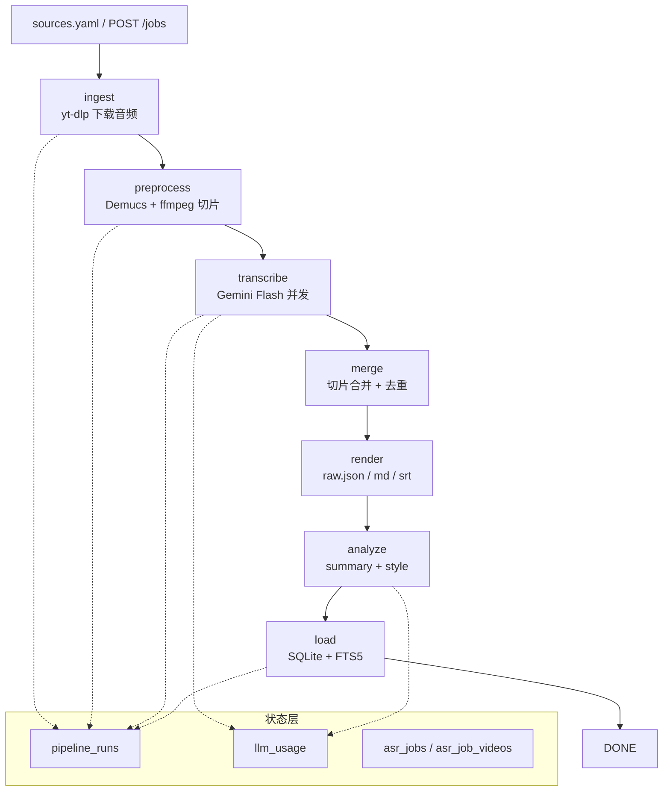
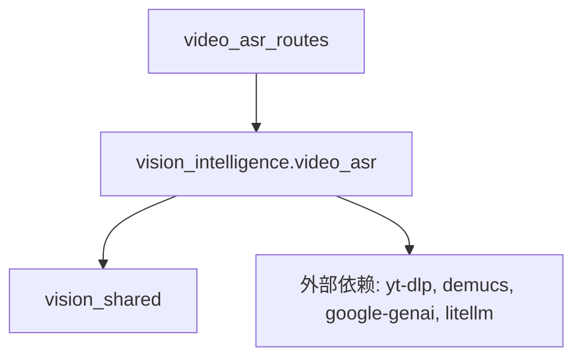

# Video ASR Pipeline Design

**Date**: 2026-04-18
**Status**: Draft — pending user review
**Package**: `vision-intelligence` (new submodule `video_asr`)

## 1. Background

项目需要把外部视频（YouTube + Bilibili）的音频内容转成结构化文本与风格档案，支持后续的直播辅助、文案提取与知识库检索。首批冷启动数据是 14 个中文长视频（10 YouTube + 4 Bilibili，平均 2 小时）。

短期目标：跑完这 14 个视频。长期目标：沉淀一套**可复用的视频语料抽取管线**，未来任意 URL 清单都能复用同一流程；接入 n8n / 未来的 Web UI / 定时调度。

本次 spec 在已完成的 Python monorepo（commit `15dcda2`）基础上新增一个子模块 `vision_intelligence.video_asr`。

## 2. Goals / Non-Goals

### Goals

- 下载音频（`yt-dlp`，YouTube + Bilibili 共用）
- Demucs 剥离 BGM → `vocals.wav`（保留）
- ffmpeg 20 分钟切片，10 秒重叠
- Gemini 2.5 Flash 转录（ADC 凭证），四档 speaker 粗标（`host / guest / other / unknown`）
- 切片合并去重 → `raw.json`
- 从 `raw.json` 渲染 `transcript.md` 与 `transcript.srt`
- Gemini 二次分析 → `summary.md` + `style.json`（风格档案）
- 扩展 `vision.db`，新增 7 张表 + FTS5 中文全文检索（jieba 预分词）
- CLI（`typer`）+ FastAPI 基础端点（提交 / 查状态 / 取产物 / 检索）
- 状态机（`pipeline_runs`）+ 成本追踪（`llm_usage`）
- 幂等、断点续跑、重试

### Non-Goals

- Web UI — 留到下一轮 spec
- pyannote 精确 diarization
- 目标说话人声学提取（VoiceFilter 类）
- 情绪 / 语速 / 声学特征分析
- LangChain
- 视频画面处理
- `python-packages/audio/` 和 `python-packages/video/` 空包

### Success Criteria

1. 14 个视频全部生成 `raw.json` / `transcript.md` / `transcript.srt` / `summary.md` / `style.json`
2. `curl -X POST /api/intelligence/video-asr/jobs` 提交 URL → 异步执行 → SSE / 轮询查进度 → `GET /videos/<id>/transcript` 拿产物
3. `uv run pytest -q` 基线保持（新增测试全绿）
4. 首批端到端总成本 < $5，端到端 < 4 小时
5. 新增来源（抖音 / 小红书等）只需加 `sources/<name>.py` 一个文件；新增 ASR 实现只需加 `asr/<name>.py`

## 3. Architecture

### 3.1 Pipeline



7 个阶段，每阶段幂等。状态权威源是 `pipeline_runs` 表，文件系统只是产物缓存。重跑只补缺失段。

### 3.2 Dependency Direction



`video_asr_routes` 是 `vision-api` 里的薄壳（HTTP 协议转换），核心业务在 `vision_intelligence.video_asr`。核心管线**不依赖** FastAPI / Typer — 那两个入口都只是转换层。

> [!IMPORTANT]
> `video_asr` 不允许 import `vision_live`。两者都属于 application 层，横向解耦；共享行为通过 `vision_shared` 走。

## 4. Module Layout

```text
python-packages/intelligence/src/vision_intelligence/video_asr/
├── __init__.py
├── config.py                # pydantic-settings：并发数 / 切片长度 / 模型名
├── models.py                # SourceMetadata / ChunkTranscript / RawTranscript / StyleProfile
├── sources/
│   ├── __init__.py
│   ├── base.py              # VideoSource protocol
│   ├── base_test.py
│   ├── yt_dlp_source.py     # YouTube + Bilibili（yt-dlp 原生支持两者）
│   ├── yt_dlp_source_test.py
│   ├── registry.py          # URL → source 路由
│   └── registry_test.py
├── asr/
│   ├── __init__.py
│   ├── base.py              # Transcriber protocol
│   ├── gemini.py            # Gemini 2.5 Flash 实现
│   └── gemini_test.py
├── preprocessor.py          # Demucs + ffmpeg 切片
├── preprocessor_test.py
├── merger.py                # 切片合并 + 时间戳去重
├── merger_test.py
├── renderer.py              # raw.json → md / srt
├── renderer_test.py
├── analyzer.py              # summary + style 抽取
├── analyzer_test.py
├── storage.py               # SQLite + FTS5 + pipeline_runs / llm_usage / asr_jobs
├── storage_test.py
├── jobs.py                  # JobManager：asyncio.Task 管理
├── jobs_test.py
├── pipeline.py              # 7 阶段编排
├── pipeline_test.py
├── cli.py                   # typer 入口
└── prompts/
    ├── transcribe.md        # ASR prompt
    ├── summarize.md         # 摘要 prompt
    └── style.md             # 风格档案 prompt

python-packages/api/src/vision_api/
├── video_asr_routes.py      # HTTP ↔ pipeline 薄壳
└── video_asr_routes_test.py

config/video_asr/
└── sources.yaml             # 14 视频清单（入 git）

output/transcripts/
├── .gitkeep
└── <video_id>/              # 每视频一个目录（gitignore）
    ├── source.json
    ├── audio.m4a
    ├── vocals.wav
    ├── chunks/
    │   ├── chunk_000.wav
    │   ├── chunk_000.json
    │   └── ...
    ├── raw.json
    ├── transcript.md
    ├── transcript.srt
    ├── summary.md
    ├── style.json
    └── stages/              # 每阶段留档 manifest（详见 §6.6）
        ├── 01-ingest.json
        ├── 02-preprocess.json
        ├── 03-transcribe.json
        ├── 04-merge.json
        ├── 05-render.json
        ├── 06-analyze.json
        └── 07-load.json
```

## 5. Package Dependencies

更新 `python-packages/intelligence/pyproject.toml`：

```toml
[project]
name = "vision-intelligence"
version = "0.1.0"
description = "Vision intelligence modules (video ASR, competitor monitoring, topic discovery)"
requires-python = ">=3.13"
license = { text = "MIT" }
dependencies = [
    "vision-shared",
    "yt-dlp>=2025.1.0",
    "demucs>=4.0.1",
    "ffmpeg-python>=0.2.0",
    "google-genai>=1.72.0",
    "litellm>=1.50.0",
    "typer>=0.12.0",
    "pydantic>=2.9.0",
    "pydantic-settings>=2.0",
    "structlog>=24.4.0",
    "tenacity>=9.0.0",
    "jieba>=0.42.1",
    "opencc-python-reimplemented>=0.1.7",   # 繁简统一
]

[project.scripts]
vision-video-asr = "vision_intelligence.video_asr.cli:app"

[build-system]
requires = ["hatchling"]
build-backend = "hatchling.build"

[tool.hatch.build.targets.wheel]
packages = ["src/vision_intelligence"]
```

更新 `python-packages/api/pyproject.toml` dependencies 新增 `vision-intelligence`（之前本来就在，无需改动）。

### System Dependencies

- `ffmpeg` 二进制（macOS: `brew install ffmpeg`）
- `gcloud` CLI + `gcloud auth application-default login`（Vertex ADC 凭证）

这些在 `CONTRIBUTING.md` 补一节说明。

## 6. Data Structures

### 6.1 `config/video_asr/sources.yaml`

```yaml
videos:
  - id: 0y3O90vyKNo
    source: youtube
    url: https://www.youtube.com/watch?v=0y3O90vyKNo
  - id: BV1at4y1h7X4
    source: bilibili
    url: https://www.bilibili.com/video/BV1at4y1h7X4/
  # ... 共 14 条
```

### 6.2 `raw.json`（每视频一份）

```jsonc
{
  "video_id": "0y3O90vyKNo",
  "source": "youtube",
  "url": "https://www.youtube.com/watch?v=0y3O90vyKNo",
  "title": "...",
  "uploader": "...",
  "duration_sec": 7234.5,
  "asr_model": "gemini-2.5-flash",
  "asr_version": "2026-04-18",
  "processed_at": "2026-04-18T12:00:00+08:00",
  "bgm_removed": true,
  "segments": [
    {
      "idx": 0,
      "start": 0.52,
      "end": 4.87,
      "speaker": "host",          // host | guest | other | unknown
      "text": "家人们晚上好……",
      "text_normalized": "家人们晚上好……",  // jieba 分词后（空格分隔）用于 FTS5
      "confidence": 0.93,
      "chunk_id": 0
    }
  ]
}
```

字段说明：

- `start` / `end` 用秒（float），不用 `HH:MM:SS,mmm` 字符串
- `speaker` 四档枚举，LLM prompt 粗分（不做跨切片对齐）
- `text` 保留 Gemini 原始输出，`text_normalized` 是 jieba 预分词结果
- `chunk_id` 保留切片溯源，便于单阶段重跑

### 6.3 `style.json`（风格档案）

```json
{
  "video_id": "0y3O90vyKNo",
  "host_speaking_ratio": 0.78,
  "speaker_count": {"host": 1, "guest": 1, "other": 3, "unknown": 0},
  "top_phrases": [{"phrase": "家人们", "count": 42}, {"phrase": "这个真的", "count": 28}],
  "catchphrases": ["这个真的", "说实话", "冲就完了"],
  "opening_hooks": ["家人们晚上好，今天给大家带来……"],
  "cta_patterns": ["点个小黄车", "双击屏幕", "库存不多"],
  "transition_patterns": ["接下来我们看……", "说到这里……"],
  "sentence_length": {"p50": 12, "p90": 28, "unit": "chars"},
  "tone_tags": ["热情", "煽动", "亲和"],
  "english_ratio": 0.04
}
```

### 6.4 SQLite Schema（扩展 `vision.db`）

在现有 `tts_log / event_log / live_plans` 基础上新增 7 张表：

```sql
CREATE TABLE video_sources (
  video_id TEXT PRIMARY KEY,
  source TEXT NOT NULL,              -- youtube | bilibili | ...
  url TEXT NOT NULL,
  title TEXT,
  uploader TEXT,
  duration_sec REAL,
  downloaded_at TEXT,
  processed_at TEXT,
  bgm_removed INTEGER,               -- 0 | 1
  asr_model TEXT,
  reviewed INTEGER NOT NULL DEFAULT 0,  -- 0 | 1，本轮不实现 review 流程，但 schema 占位
  reviewed_at TEXT
);

CREATE TABLE transcript_segments (
  video_id TEXT NOT NULL,
  idx INTEGER NOT NULL,
  start REAL NOT NULL,
  end REAL NOT NULL,
  speaker TEXT NOT NULL,             -- host | guest | other | unknown
  text TEXT NOT NULL,
  text_normalized TEXT NOT NULL,     -- jieba 分词结果，空格分隔
  chunk_id INTEGER,
  PRIMARY KEY (video_id, idx),
  FOREIGN KEY (video_id) REFERENCES video_sources(video_id)
);

CREATE VIRTUAL TABLE transcript_fts USING fts5(
  video_id UNINDEXED,
  idx UNINDEXED,
  text_normalized,
  tokenize='unicode61 remove_diacritics 0'
);

-- FTS5 与 transcript_segments 同步：入库时显式写两次，不用 trigger（simpler + 可预测）

CREATE TABLE style_profiles (
  video_id TEXT PRIMARY KEY,
  profile_json TEXT NOT NULL,
  FOREIGN KEY (video_id) REFERENCES video_sources(video_id)
);

CREATE TABLE pipeline_runs (
  video_id TEXT NOT NULL,
  stage TEXT NOT NULL,               -- ingest|preprocess|transcribe|merge|render|analyze|load
  status TEXT NOT NULL,              -- pending|running|done|failed
  started_at TEXT,
  finished_at TEXT,
  duration_sec REAL,
  error TEXT,
  PRIMARY KEY (video_id, stage)
);

CREATE TABLE llm_usage (
  id INTEGER PRIMARY KEY AUTOINCREMENT,
  video_id TEXT,
  stage TEXT,
  model TEXT,
  input_tokens INTEGER,
  output_tokens INTEGER,
  estimated_cost_usd REAL,
  called_at TEXT
);

CREATE TABLE asr_jobs (
  job_id TEXT PRIMARY KEY,
  created_at TEXT,
  source TEXT,                       -- cli | api
  status TEXT,                       -- running|done|failed|partial
  video_count INTEGER,
  urls_hash TEXT                     -- 用于幂等检测
);

CREATE TABLE asr_job_videos (
  job_id TEXT,
  video_id TEXT,
  PRIMARY KEY (job_id, video_id),
  FOREIGN KEY (job_id) REFERENCES asr_jobs(job_id)
);
```

> [!NOTE]
> `transcript_fts` 与 `transcript_segments` 在代码里显式双写（见 `storage.py`）。不用 SQLite trigger，便于后续变更调度。

### 6.5 Data Cleaning Strategy

Gemini 原始输出不能直接入库/上线，需要在管线内部做统一清洗。职责按阶段划分：

#### 6.5.1 `merger.py` 清洗（转录阶段内部）

合并切片时执行，对每个 segment：

- **丢弃空段**：`text.strip() == ""` 直接跳过
- **时间戳修正**：`start > end` 时交换两值并打 warning log
- **重叠去重**：相邻切片的重叠窗口（10s）里若文本字符串相似度 > 0.9（`difflib.SequenceMatcher`）判定为同一句，保留前一切片的版本
- **标点规范化**：半角 → 全角（`, . ? ! ;` → `，。？！；`），但保留中英夹杂里英文词内的半角（"iPhone 15"、"AI" 等识别规则见 `merger.py` 注释）
- **繁简统一**：`opencc t2s` 转换为简体（即使素材都是简体也无伤，失败场景简单可控）

输出为 segment 的 `text` 字段（已清洗）。

#### 6.5.2 `storage.py` 生成 `text_normalized`

入库前从 `text` 派生 `text_normalized`：

1. `text` 已经过 §6.5.1 的清洗
2. 对 `text` 调 `jieba.cut` 得到词列表
3. 词之间用空格拼接 → `text_normalized`
4. 同时写入 `transcript_segments.text_normalized` 与 `transcript_fts.text_normalized`

查询时（CLI `search` 子命令 / FastAPI `/search` 端点）对用户输入也先过 jieba，拼成空格分隔的 FTS5 query string。

#### 6.5.3 `analyzer.py` 输入过滤（风格档案阶段）

生成 `style.json` 前先过滤 segment 集合：

- **只保留 `speaker == "host"`**：风格档案是主播专属，其他 speaker 的话不参与统计
- **丢弃 `confidence < 0.6`**：低置信度段视为 Gemini 不确定，不当作真实话术
- 过滤后的文本再喂给 Gemini 做摘要与风格抽取

#### 6.5.4 Review 字段（未来扩展）

`video_sources` 表预留 `reviewed INTEGER DEFAULT 0` + `reviewed_at` 字段。本轮 spec **不实现** 人工校对流程（CLI / UI 都不做）。未来接入时只需：

- 新增 `vision-video-asr review <video_id>` 子命令或 Web UI 审核页
- 校对通过后 `UPDATE video_sources SET reviewed = 1, reviewed_at = ... WHERE video_id = ?`
- 下游消费方（RAG / DirectorAgent）可按 `reviewed = 1` 过滤，避免未审核数据污染生产

### 6.6 Stage Manifests

每个 pipeline 阶段完成时写一份 JSON manifest 到 `output/transcripts/<video_id>/stages/NN-<name>.json`，记录该阶段的参数、输入输出、耗时、成本。用途：

- **从任意阶段重跑**：CLI `rerun --from-stage <name>` 会读取前序 manifest 恢复上下文
- **审计**：看到某视频的产物，能立刻知道用的是哪个 prompt 版本、哪个模型、花了多少钱
- **对比**：换 prompt 或模型后重跑，manifest 差异直接反映配置差异

#### 6.6.1 通用 schema

每份 manifest 都含以下字段（阶段特定字段另有扩展，见 6.6.2）：

```jsonc
{
  "stage": "transcribe",                    // ingest | preprocess | transcribe | merge | render | analyze | load
  "video_id": "0y3O90vyKNo",
  "status": "done",                         // done | failed
  "started_at": "2026-04-18T12:00:00+08:00",
  "finished_at": "2026-04-18T12:03:15+08:00",
  "duration_sec": 195.3,
  "inputs": ["audio.m4a"],                  // 相对 <video_id>/ 的路径
  "outputs": ["vocals.wav", "chunks/*.wav"],
  "tool_versions": {                        // 关键依赖版本
    "yt-dlp": "2025.1.15",
    "demucs": "4.0.1",
    "ffmpeg": "7.1",
    "google-genai": "1.72.0"
  },
  "pipeline_version": "0.1.0",              // 本包的 __version__
  "error": null                             // status=failed 时填 traceback 摘要
}
```

#### 6.6.2 阶段特定字段

- **`01-ingest.json`**：`url`、`downloaded_bytes`、`source_metadata`（title / uploader / duration_sec / 原始 yt-dlp info 摘要）
- **`02-preprocess.json`**：`demucs_model`、`bgm_removed`、`chunk_count`、`chunk_duration_sec`、`chunk_overlap_sec`、`sample_rate`、`channels`
- **`03-transcribe.json`**：
  - `model`（`gemini-2.5-flash`）
  - `prompt_version`（`prompts/transcribe.md` 的 git sha 或内容 sha256，前 12 位）
  - `response_schema_version`（pydantic model `__version__` 或 schema 哈希）
  - `chunks_transcribed`、`chunks_failed`、`retries`
  - `tokens_in`、`tokens_out`、`estimated_cost_usd`
- **`04-merge.json`**：`segments_in`（切片合计）、`segments_out`（合并后）、`dedup_count`、`timestamp_fixes`、`empty_dropped`、`punctuation_normalized`、`t2s_converted`
- **`05-render.json`**：`outputs`（`transcript.md` / `transcript.srt`）、`renderer_version`、`total_segments`、`total_duration_sec`
- **`06-analyze.json`**：
  - `model`（同 03）
  - `prompt_version`（`prompts/summarize.md` + `prompts/style.md` 合并 hash）
  - `segments_in`、`segments_filtered_out`（§6.5.3 的 non-host / low-confidence 过滤数量）
  - `tokens_in`、`tokens_out`、`estimated_cost_usd`
- **`07-load.json`**：`rows_inserted`（`{video_sources: 1, transcript_segments: 342, transcript_fts: 342, style_profiles: 1}`）

#### 6.6.3 读写语义

- `pipeline.py` 在进入每阶段前 instantiate manifest 对象，finally 块写磁盘（无论成败都写）
- 重跑时 `pipeline.py` 读已有 manifest，若 `status == "done"` 且 `inputs` hash 没变 → 跳过该阶段
- `rerun --from-stage transcribe` 显式删除 `03-transcribe.json` 及之后所有阶段的 manifest，然后走正常管线
- **Manifest 是权威真相源**（和 `pipeline_runs` 表并存）：表便于 SQL 查询，manifest 便于人读 + git diff + 单文件移植

> [!NOTE]
> `stages/` 和 `pipeline_runs` 表不是冗余 —— 前者是"产物级"落盘（每视频自包含、可带走、可人读），后者是"调度级"状态机（可 JOIN、可索引、可查多视频聚合）。两者信息基本重叠，允许偶然漂移；`pipeline_runs` 是状态机当前态的视图，`stages/` 是历史存档。

## 7. FastAPI Endpoints

所有端点挂在 `/api/intelligence/video-asr/`：

```text
POST  /api/intelligence/video-asr/jobs
      body: { urls: [...] }  或  { sources_yaml: "config/video_asr/sources.yaml" }
      resp: { job_id, video_ids, status: "accepted" }

GET   /api/intelligence/video-asr/jobs/{job_id}
      resp: { job_id, videos: [{video_id, stage, status, duration_sec}], overall_status, cost_usd }

GET   /api/intelligence/video-asr/jobs/{job_id}/events    (SSE)
      推送 pipeline_runs 变更，Last-Event-ID header 支持重连 replay

GET   /api/intelligence/video-asr/videos/{video_id}
GET   /api/intelligence/video-asr/videos/{video_id}/transcript        # raw.json
GET   /api/intelligence/video-asr/videos/{video_id}/transcript.md     # text/markdown
GET   /api/intelligence/video-asr/videos/{video_id}/transcript.srt    # text/plain
GET   /api/intelligence/video-asr/videos/{video_id}/summary           # summary.md
GET   /api/intelligence/video-asr/videos/{video_id}/style             # style.json

POST  /api/intelligence/video-asr/videos/{video_id}/rerun
      body: { stages?: ["transcribe", "merge"] }           # 不传则全重跑
      resp: { video_id, status: "restarted" }

GET   /api/intelligence/video-asr/search?q=家人们&limit=50  # FTS5 跨视频检索
```

### 7.1 Execution Model

- `POST /jobs` 立即返回 `job_id`，管线通过 `asyncio.create_task` 在 FastAPI event loop 里跑
- 不引入 Celery / RQ / Redis；核心管线是纯函数 + SQLite 状态，未来要多进程换 `arq` / `dramatiq` 成本低
- **幂等 POST**：对 `urls` 做 sha256 得到 `urls_hash`，若 `asr_jobs` 已有同 hash 的 running job，返回其 `job_id`，不重建

### 7.2 Auth

所有写端点（`POST /jobs`、`POST /rerun`）通过 `X-API-Key` header 校验。Key 在 `.env` 里配（`VISION_API_KEY`），middleware 在 `vision_api.main` 注册。读端点不加校验（只读转录数据不敏感）。

### 7.3 SSE Reconnection

客户端（n8n HTTP Request 的 SSE 模式 / 将来的 Web UI）断线后带 `Last-Event-ID` 重连，服务端从 `pipeline_runs` 按 `(video_id, stage)` 顺序回放未送达的 event。

## 8. CLI

通过 `typer` 暴露 `vision-video-asr` 命令（`pyproject.toml` 里 `[project.scripts]` 注册）：

```bash
# 从 yaml 清单一次性跑完
uv run vision-video-asr run --sources config/video_asr/sources.yaml

# 跑单条
uv run vision-video-asr run --url https://www.youtube.com/watch?v=0y3O90vyKNo

# 查 job 进度（CLI 直接读 SQLite，不走 HTTP）
uv run vision-video-asr status <job_id>

# 单阶段重跑（显式列出要跑的阶段）
uv run vision-video-asr rerun <video_id> --stages transcribe,merge

# 从某阶段起重跑（之前阶段的产物 / manifest 保留并复用）
uv run vision-video-asr rerun <video_id> --from-stage transcribe

# 跨视频 FTS5 检索
uv run vision-video-asr search "家人们晚上好" --limit 20

# 导出
uv run vision-video-asr export --format jsonl > all_transcripts.jsonl
```

`cli.py` 是薄壳，所有逻辑在 `pipeline.py` / `jobs.py` / `storage.py`。

### 8.1 Makefile Integration

`Makefile.mac` 加一个 target：

```make
asr:
	uv run vision-video-asr run --sources config/video_asr/sources.yaml
```

## 9. Error Handling & Resilience

- **Gemini 429 / 5xx**：`tenacity` 指数退避 + jitter，最多 5 次
- **Demucs OOM / yt-dlp 403**：单视频失败写 `pipeline_runs.error`，不中断 batch；后续可单独 rerun
- **切片级原子性**：`chunk_NNN.json` 独立；重跑只补缺失段
- **下载防封**：串行下载、随机 UA、B 站限速（yt-dlp 默认就够）
- **幂等 POST /jobs**：`urls_hash` 命中 running job → 返回已有 `job_id`
- **SSE 断线**：`Last-Event-ID` 重连 replay
- **Vertex ADC 过期**：启动时 probe 一次（一个 1-token 请求），失败直接 `Status: failed, error="ADC expired, run gcloud auth application-default login"`

## 10. Testing Strategy (TDD — constitution 硬要求)

每模块先写测试：

- `sources/registry_test.py` — URL 路由（YouTube / Bilibili 分发到 yt_dlp_source）
- `sources/yt_dlp_source_test.py` — mock subprocess，验证 yt-dlp 参数构造 + 元数据抽取
- `preprocessor_test.py` — mock demucs / ffmpeg，验证切片边界和文件命名
- `asr/gemini_test.py` — mock genai client，验证 prompt 构造 + response_schema + tenacity 重试
- `merger_test.py` — fixture 切片 JSON，验证重叠去重 + 时间戳单调 + §6.5.1 清洗（空段 / start>end / 标点规范化 / 繁简统一）
- `renderer_test.py` — snapshot md / srt 输出
- `analyzer_test.py` — mock genai，验证风格字段抽取 + §6.5.3 输入过滤（speaker != host 被排除 / confidence < 0.6 被排除）
- `storage_test.py` — in-memory SQLite + FTS5 检索，§6.5.2 `text_normalized` 生成链（jieba 分词结果验证）
- `jobs_test.py` — mock pipeline，验证 asyncio.Task 生命周期 + 幂等
- `pipeline_test.py` — 端到端（mock 外部调用），验证 7 阶段 + 状态机 + 断点续跑 + §6.6 每阶段 manifest 写入 + `rerun --from-stage` 跳过已完成阶段 + 删除后续阶段 manifest
- `video_asr_routes_test.py` — FastAPI TestClient，验证 HTTP 契约 + SSE 回放 + API key

**不写自动化**：真实 Gemini / 真实 yt-dlp / 真实 Demucs 集成测试。首次手动跑 14 视频就是冒烟测试。

## 11. Risks & Mitigations

### 11.1 Identified Risks

1. **Demucs 首次运行下载模型（~300MB）**
   - 缓解：CI 不跑 Demucs；本地首次跑显式说明

2. **Vertex ADC token 过期**
   - 缓解：启动 probe（§9），错误信息明确引导

3. **Gemini 单次输出被截断**
   - 缓解：切片策略已经把单请求降到 ~8k 输出 token，远低于 Flash 上限

4. **SQLite 并发写**
   - 缓解：`aiosqlite` + 串行执行管线阶段；跨 video 并发，单 video 内串行

5. **Bilibili 反爬**
   - 缓解：串行下载、yt-dlp 自带的限速与重试

6. **jieba 进程启动慢**
   - 缓解：进程启动时一次性加载，之后分词 <1ms；不影响常驻服务

### 11.2 Rollback

所有改动在 feature 分支 `feat/video-asr` 上。失败 → 丢弃分支。数据库 schema migration 走独立 script（见 §12）。

## 12. Migration

`vision.db` 已有 3 张表，新增 7 张 + 1 个 FTS5 虚拟表。写一次性 migration 脚本：

`python-packages/intelligence/src/vision_intelligence/video_asr/storage.py` 里 `init_schema()` 函数用 `CREATE TABLE IF NOT EXISTS` + `CREATE VIRTUAL TABLE IF NOT EXISTS`。第一次 import 时调一下，后续幂等。

不引入 alembic / yoyo-migrations — 仓库现在也没这层抽象，先不加。未来 schema 真复杂了再说。

## 13. Out of Scope (Explicitly Deferred)

- Web UI（Next.js 页面 `/intelligence/video-asr/*`）→ 下一轮 spec
- n8n Custom Node（OpenAPI schema 自动生成够 n8n 用，不专门做 node）
- 多租户 / 用户隔离
- 导出到 Notion / Obsidian / Anki 的集成
- 风格档案可视化（雷达图 / 词云等）
- 向量化 + 语义检索（当前用 FTS5 够了，RAG 有独立链路）
- 自动触发（定时抓新视频）
- 前端实时展示 cost 仪表盘

## 14. Open Questions (Resolved)

本节记录 brainstorm 决定，供将来参考：

- **模块归属**：`vision_intelligence.video_asr` 子模块，不独立包
- **`sources.yaml` 位置**：`config/video_asr/sources.yaml`（入 git）
- **`vocals.wav`**：保留
- **Speaker 档位**：四档 `host / guest / other / unknown`
- **本轮做 API 端点**：是（CLI + FastAPI 基础端点）
- **Web UI**：否（下一轮）
- **`audio/` `video/` 预建空包**：否
- **FTS5 分词方案**：jieba（精度优先，后续疯狂扩展）
- **API Key middleware**：启用（`X-API-Key`）
- **`output/transcripts/.gitkeep`**：加
- **Makefile `asr` target**：加
- **LLM gateway**：沿用 LiteLLM + `google-genai`（不引入 LangChain）
- **Vertex 凭证**：ADC
- **数据清洗**：加 §6.5 三层清洗策略（merger / storage / analyzer），review 字段 schema 占位但本轮不实现功能
- **繁简统一工具**：`opencc-python-reimplemented`（而非手写字典）
- **阶段留档**：加 §6.6 每阶段 `stages/NN-<name>.json` manifest，记 prompt 版本 / 模型 / 成本 / 输入输出；CLI 新增 `rerun --from-stage` 子命令（不走 SQLite metadata_json，不给产物文件名带 hash）
