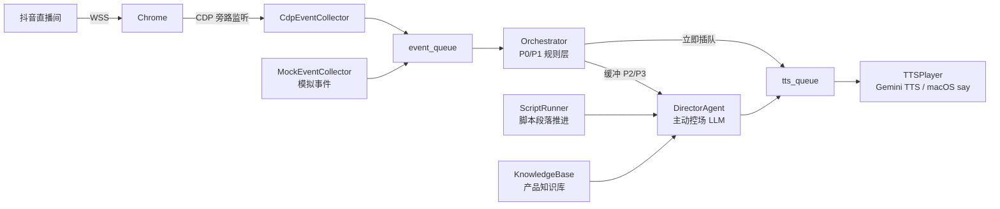

# live — 直播控场 Agent

实时读取直播脚本并按节奏驱动 TTS 播报，同时捕获弹幕/礼物/进场互动，由两层决策引擎（规则 + LLM）判断是否回应以及如何回应，不会打乱既定直播节奏。

## 架构



多个并发组件各跑一个后台线程，主循环每 0.5s 轮询一次。

| 模块 | 文件 | 职责 |
|------|------|------|
| `ScriptRunner` | `script_runner.py` | 按 YAML 脚本定时推进段落 |
| `CdpEventCollector` | `cdp_collector.py` | 通过 Chrome DevTools Protocol 旁路监听 WSS 帧（跨平台） |
| `MockEventCollector` | `event_collector.py` | 回放模拟弹幕/礼物时间线（开发用） |
| `Orchestrator` | `orchestrator.py` | P0/P1 规则中断层，P2/P3 缓冲给 DirectorAgent |
| `DirectorAgent` | `director_agent.py` | 主动控场：读脚本/知识库/互动，LLM 决定下一句台词 |
| `KnowledgeBase` | `knowledge_base.py` | 加载产品 YAML，提供 LLM 上下文字符串 |
| `TTSPlayer` | `tts_player.py` | 队列消费，调用 Gemini TTS 播音 |

## 决策架构

**规则层（Orchestrator）** — 毫秒级响应，P0/P1 立即插队 TTS

| 优先级 | 触发条件 | 行为 |
|--------|----------|------|
| P0 | 礼物价值 ≥ 50 元 | 立即 TTS 致谢 |
| P1 | 粉丝进场 | 立即 TTS 欢迎 |
| P2 | 含问号的弹幕 | 缓冲 → DirectorAgent 处理 |
| P3 | 其他弹幕/低价礼物 | 缓冲 → DirectorAgent 处理 |

**控场层（DirectorAgent）** — 主动驱动，持续输出

DirectorAgent 在两种情况下触发 LLM 调用：
- TTS 队列空 + 没在说话 → 立即触发（防冷场）
- 超过 15s 没有新输出 → 强制触发

每次触发，LLM 拿到完整上下文：
- 当前脚本段落原文 + 关键词 + 剩余时间
- 产品知识库（卖点、FAQ、禁用词）
- 最近 10 条观众互动
- 上一句说了什么

LLM 输出下一句台词（改写脚本，自然口语化），同时给出 `speech_prompt`（朗读风格），两者一起送进 Gemini TTS。

## TTS 语音风格

TTS 内容以 `"{speech_prompt}：{text}"` 形式传入 Gemini，语气和语速由场景驱动：

- **P0 大额礼物** → 真情流露的惊喜，语气先快后慢
- **P1 粉丝进场** → 轻快热情，像见到老朋友
- **LLM 回复** → LLM 按互动内容自行生成风格描述
- **默认兜底** → 带货主播真情流露，语气自然有情绪起伏

默认声音：**Sulafat**（Gemini TTS 内置，效果最接近自然带货口吻）

## OBS 推流接入

TTS 音频默认输出到系统默认扬声器（本地监听）。指定 `--audio-device` 后输出到虚拟音频设备，OBS 采集该设备混入直播流。

```
Gemini TTS ──→ VB-Cable（虚拟音频）──→ OBS 采集 ──→ 抖音直播
你的麦克风 ──→ OBS 采集 ──┘
```

**第一步：安装 VB-Cable**

下载安装 [VB-Audio Virtual Cable](https://vb-audio.com/Cable/)，安装后重启。设备名为 `CABLE Input`。

**第二步：OBS 配置**

音频混音器 → 添加音频输入采集 → 选择 `CABLE Output`（VB-Cable 的接收端）。

**第三步：启动 Agent**

```bash
uv run src/live/agent.py --cdp-url http://localhost:9222 --audio-device "CABLE Input"
```

> [!NOTE]
> `--audio-device` 做模糊匹配，`"CABLE"` 也能匹配到 `CABLE Input`。不指定时使用系统默认设备（适合本地开发）。

## 快速开始

Agent 通过 FastAPI 服务控制，不再支持独立 CLI。

### 环境准备

```bash
cp .env.example .env   # 填入 GOOGLE_CLOUD_PROJECT
gcloud auth application-default login
```

`.env` 示例：

```
GOOGLE_CLOUD_PROJECT=your-project-id
```

### 启动服务

```bash
uv run uvicorn src.api.main:app --reload --port 8000
```

### Mock 模式（无需 GCP，本地开发）

```bash
curl -X POST http://localhost:8000/live/start \
  -H "Content-Type: application/json" \
  -d '{"mock": true}'
```

LLM 用固定回复替代，TTS 只打印日志，不调用 API。

### 真实抖音弹幕模式

通过 Chrome DevTools Protocol 旁路监听真实 Chrome 的 WSS 帧，无需代理、无需证书，跨平台，不影响抖音风控。

**第一步：启动带调试端口的 Chrome**

Mac：
```bash
open -na "Google Chrome" --args --remote-debugging-port=9222 --user-data-dir=/tmp/chrome-cdp
```

Windows：
```bash
"C:\Program Files\Google\Chrome\Application\chrome.exe" --remote-debugging-port=9222 --user-data-dir=%TEMP%\chrome-cdp
```

**第二步：打开直播间**

在该 Chrome 窗口中打开抖音直播间，登录账号。

**第三步：通过 API 启动 Agent**

```bash
curl -X POST http://localhost:8000/live/start \
  -H "Content-Type: application/json" \
  -d '{"cdp_url": "http://localhost:9222"}'
```

> [!NOTE]
> proto 定义来源：[saermart/DouyinLiveWebFetcher](https://github.com/saermart/DouyinLiveWebFetcher)

### 生产模式（Vertex AI + Gemini TTS）

```bash
curl -X POST http://localhost:8000/live/start \
  -H "Content-Type: application/json" \
  -d '{"script": "src/live/example_script.yaml"}'
```

需要 `GOOGLE_CLOUD_PROJECT` 已设置且项目开启了 Vertex AI API。

## 直播脚本格式

```yaml
meta:
  title: "产品介绍直播示例"
  total_duration: 3600   # 总时长（秒），仅作参考

segments:
  - id: "opening"
    duration: 120          # 段落持续时长（秒）
    interruptible: true    # false = 禁止互动打断（适合核心卖点讲解）
    text: |
      大家好，欢迎来到直播间！…
    keywords: ["欢迎", "开场"]

  - id: "product_core"
    duration: 300
    interruptible: false
    text: |
      接下来重点介绍这款产品…
    keywords: ["产品", "功能"]
```

`interruptible: false` 期间，所有互动事件进入缓冲，段落结束后再批量处理。

## 试听声音

```bash
uv run src/live/try_voices.py
uv run src/live/try_voices.py --text "感谢大家的支持！" --voices Kore Sulafat Aoede
```

## 运行测试

```bash
uv run pytest tests/live/ -v
```

## 文件索引

```
src/live/
├── session.py              SessionManager，供 FastAPI 调用的生命周期管理
├── routes.py               FastAPI router（/live/*），HTTP 接口层
├── director_agent.py       主动控场 LLM 循环，决定下一句台词
├── orchestrator.py         P0/P1 规则中断层，P2/P3 缓冲
├── knowledge_base.py       加载产品 YAML，输出 LLM 上下文字符串
├── script_runner.py        脚本段落定时推进
├── cdp_collector.py        真实弹幕接收（CDP，跨平台）
├── event_collector.py      模拟事件回放（开发/测试用）
├── tts_player.py           TTS 队列消费，调用 Gemini TTS
├── schema.py               共享数据结构（Event / ScriptSegment / Decision / DirectorOutput）
├── proto_douyin.py         抖音 WebSocket 协议 protobuf 定义
├── try_voices.py           声音试听脚本
├── data/
│   └── product.yaml        产品介绍、FAQ、禁用词、必说词
└── example_script.yaml     示例直播脚本
```
